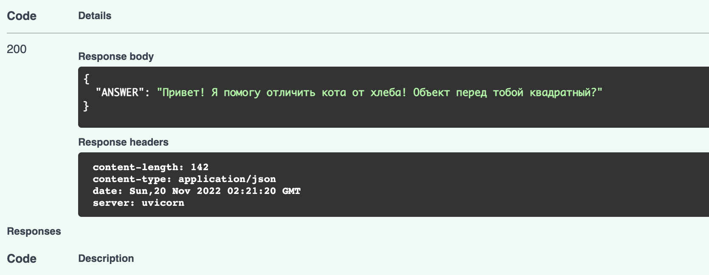

# Тестовое задание
<a href="https://codeclimate.com/github/Mechnuna/Chat-Bot-Api/maintainability"></a>
<a href="https://codeclimate.com/github/Mechnuna/Chat-Bot-Api/test_coverage"></a>
[](LICENSE)


## Mandatory part
Написать Api для чат-бота


### Установка

``git clone git@github.com:Mechnuna/Chat-Bot-Api.git``

### Запуск

**С помощью Makefile**  
``make``

**Вручную поднять Docker-compose**
```
docker-compose up
```
Или
```
pip install -e .
source venv/bin/activate
pip install -e .
uvicorn main:app
```
### SwaggerUI  
И идем на 127.0.0.1:8000/docs 
Запрос вводить в формате:
```
{
  "user_form": {
    "id": "string",
    "message": "string"
  }
}  
```
Запрос

Ответ


## Bonus part
-> develop tensorflow-api

## Запуск тестов
`pytest test`